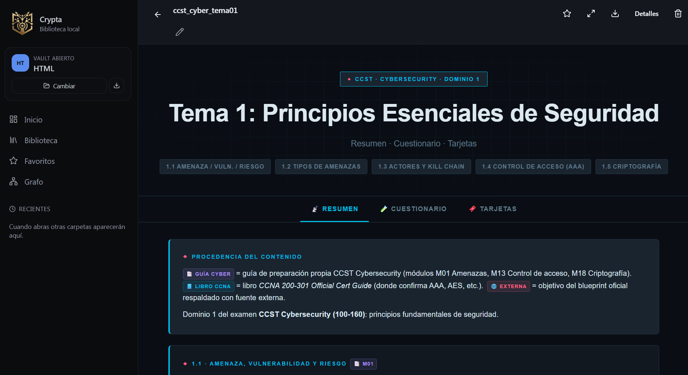
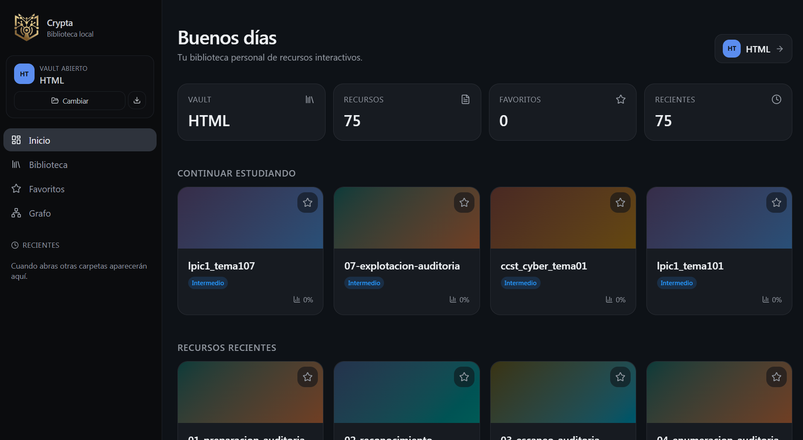

### Tu biblioteca personal de recursos interactivos.
##### Local. Sin nube. Sin cuentas.

 

 

 

---

## Qué es

**Crypta** convierte una carpeta de tu disco con archivos `.html` en una biblioteca de estudio navegable: portada con estadísticas, biblioteca, favoritos, recientes, etiquetas, dificultad, vista de grafo y vista de detalle con tabs, badges y formato cuidado.

No es un editor. **Tú aportas los HTML, Crypta los presenta**: los lee de tu carpeta, los renderiza con estilo, los organiza por categorías y los conecta entre sí. Si los modificas con cualquier editor externo, Crypta los recoge la próxima vez que abres la app — el disco es la única fuente de verdad.

---

## Pruébala

| | Cómo | Quién la necesita |
|---|---|---|
| **Demo web** | [narufortix.github.io/crypta-releases](https://narufortix.github.io/crypta-releases/) | Cualquiera con Chrome o Edge moderno. No requiere instalación. Selecciona una carpeta local y empieza. |
| **Windows nativo** | [Descargar instalador](https://github.com/narufortix/crypta-releases/releases) | Si quieres la experiencia completa: arranque instantáneo, integración con el sistema, sin tab del navegador. |

> La demo web usa la **File System Access API** (Chromium). Firefox y Safari no la soportan todavía — para esos navegadores, usa la versión Windows.

---

## Qué hace

- **Inicio** — Estadísticas del vault, continuar estudiando, recientes, favoritos, más usados.
- **Biblioteca** — Lista completa con filtros por carpeta, categoría, dificultad, etiqueta y búsqueda.
- **Vista de recurso** — Renderiza el HTML completo en un iframe aislado, con tabs para navegación interna, badges de procedencia y formato propio.
- **Favoritos** — Marca lo importante, accede en un clic.
- **Grafo** — Visualización de conexiones entre recursos por categoría.
- **Importar** — Arrastra HTML a la carpeta del vault, o cárgalos desde la UI.

---

## Tecnologías

<table>
<tr>
<td valign="top" width="120" align="center">

**INTERFAZ**

</td>
<td valign="top">

*UI declarativa y router con manejo de estado del lado cliente*

- **React 19** — componentes funcionales con hooks modernos
- **TanStack Router & Start** — routing tipado y SPA estática
- **Tailwind 4** + **shadcn/ui** — sistema de diseño consistente
- **Zustand** — store global ligero, sin boilerplate

</td>
</tr>
<tr>
<td valign="top" width="120" align="center">

**RUNTIME**

</td>
<td valign="top">

*Capa nativa multiplataforma sobre WebView del sistema*

- **Tauri 2.11** — bundle Windows ~5 MB, instalador NSIS per-user
- **Rust 1.96** — backend nativo con perfil release endurecido (strip, LTO, panic abort)
- **WebView2** — render del frontend con el motor del sistema
- **Plugins fs + dialog** — acceso a filesystem y diálogos nativos

</td>
</tr>
<tr>
<td valign="top" width="120" align="center">

**DATOS**

</td>
<td valign="top">

*Almacenamiento sobre filesystem, sin base de datos embebida*

- **Filesystem nativo** — los `.html` son la verdad, no hay caché que invalidar
- **`.crypta/meta.json`** — metadatos del vault (categorías, favoritos, recientes)
- **File System Access API** — en la demo web, mismo modelo sobre Chromium
- **Dual runtime** — el mismo código TypeScript funciona en Tauri y en navegador

</td>
</tr>
<tr>
<td valign="top" width="120" align="center">

**SEGURIDAD**

</td>
<td valign="top">

- **CSP estricta** — `default-src 'self'`, sin conexiones externas
- **Scope FS dinámico** — el plugin de filesystem arranca con scope vacío y solo se concede acceso a la carpeta que el usuario elige
- **Iframe sandbox** — el HTML del recurso queda aislado del resto de la app
- **Binario stripped** — sin símbolos de debug, rutas de build remapeadas

</td>
</tr>
</table>

---

## Estado

- ✅ **Windows** — instalador NSIS estable (per-user, sin permisos admin si instalas en una ruta de usuario).
- ✅ **Demo web** — sirve para evaluar, requiere navegador Chromium.

---

## Cambios

Las versiones publicadas y sus notas viven en [Releases](https://github.com/narufortix/crypta-releases/releases). Cada release incluye el `.msi` y el `.exe` (NSIS) para Windows x64.